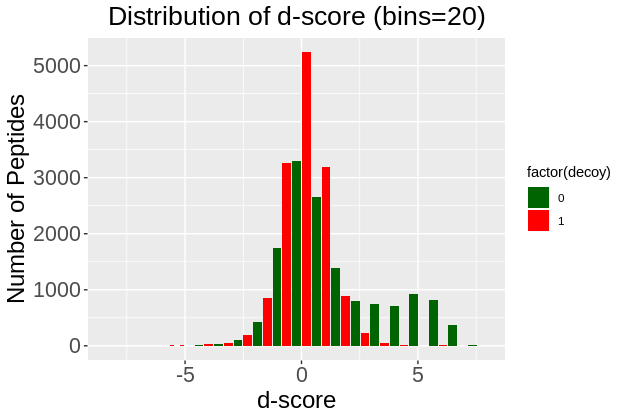
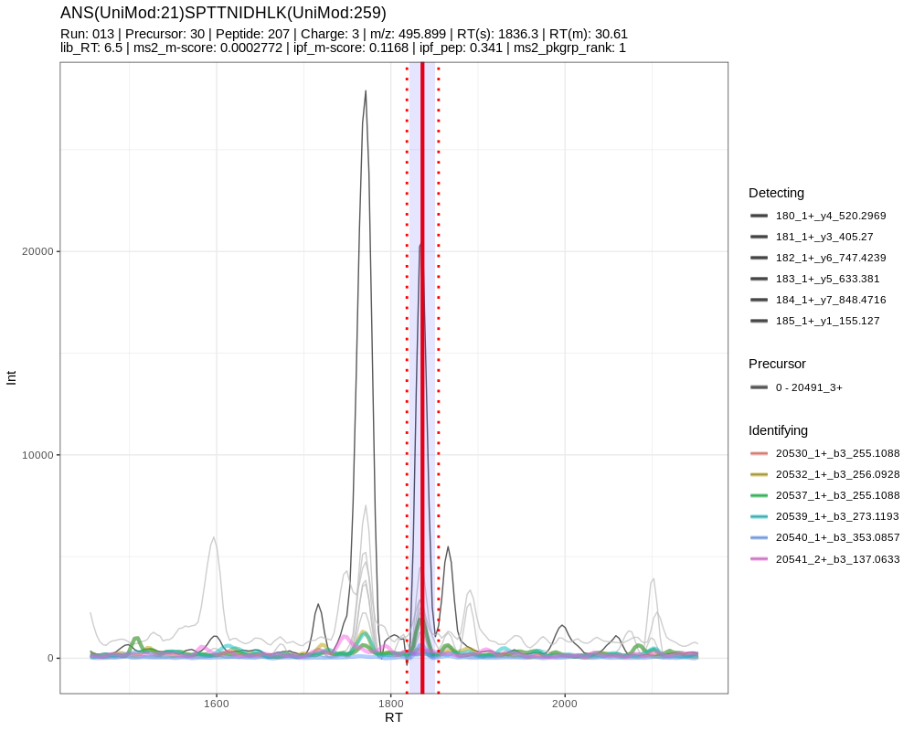

```{r, include = FALSE}
knitr::opts_chunk$set(
  collapse = TRUE,
  comment = "#>"
)
```

# Load Library
```{r setup, warning=FALSE}
library(mstools)
```

# Loading a merged OSW results file for inspection
```{r}
## Specify path to merged osw file
in_osw <- "../inst/extdata/Synthetic_Dilution_Phosphoproteomics/osw/merged.merged.osw"
## Call getOSWData_ function
osw_dt <- mstools::getOSWData_(oswfile = in_osw)
head(osw_dt, 5)
```

## Visualizing d-score distribution
```
## Specify path to merged osw file
in_osw <- "/media/justincsing/ExtraDrive1/Documents2/Roest_Lab/Github/PTMs_Project/Synth_PhosoPep/Justin_Synth_PhosPep/results/pyprophet/merged.osw"
## Call getOSWData_ function
### NOTE: peak_group_rank_filter is set to TRUE to only filter for the top peak_group_rank 1 features
### NOTE: decoy_filter is set to FALSE to keep decoy peptides 
osw_dt <- mstools::getOSWData_(oswfile = in_osw, peak_group_rank_filter = TRUE, decoy_filter = FALSE)
### Call sub-function of osw_reports_visualization to visualize d-score distribution
mstools::osw_reports_visualization$d_score_hist( osw = osw_dt, bins = 20, position = 'dodge2' )
```


# Visualizing Chromatogram
```
library(dplyr)
## Specify path to merged osw file
in_osw <- "/media/justincsing/ExtraDrive1/Documents2/Roest_Lab/Github/mstools/inst/extdata/Synthetic_Dilution_Phosphoproteomics/osw/merged.merged.osw"
## Specify path to library
in_lib <- "/media/justincsing/ExtraDrive1/Documents2/Roest_Lab/Github/mstools/inst/extdata/Synthetic_Dilution_Phosphoproteomics/pqp/psgs_phospho_optimized_decoys.pqp"
## Specify path to sqMass  Chromatogram
in_sqmass<- "/media/justincsing/ExtraDrive1/Documents2/Roest_Lab/Github/mstools/inst/extdata/Synthetic_Dilution_Phosphoproteomics/sqmass/chludwig_K150309_013_SW_0.chrom.sqMass"
### OR
## Specify path to mzML Chromatogram
in_mzml <- "/media/justincsing/ExtraDrive1/Documents2/Roest_Lab/Github/mstools/inst/extdata/Synthetic_Dilution_Phosphoproteomics/mzml/chludwig_K150309_013_SW_0.chrom.mzML"
## Specify path to a tsv file of manual annotations if you have one. (Optional, if you have manual coordications, that is fine as well)
in_manual_annotations <- "/media/justincsing/ExtraDrive1/Documents2/Roest_Lab/Github/mstools/inst/extdata/Synthetic_Dilution_Phosphoproteomics/manual_annotations/chludwig_K150309_013_SW_0_filtered.tsv"
### Read in manual annotations into data.table
annotation_dt <- data.table::fread(in_manual_annotations)
colnames(annotation_dt)
annotation_dt$FullPeptideName <- gsub("unimod", "UniMod", annotation_dt$`Modified Sequence Unimod Ids`)
## Specify peptide sequence and unique modified peptide sequence (optional) and target charge
dup_peps = "ANSSPTTNIDHLK"; uni_mod = "ANS(UniMod:21)SPTTNIDHLK(UniMod:259)"; target_charge = 3
## Get manual annotation coordinates for the given peptide
annotation_dt %>%
  dplyr::filter( FullPeptideName==uni_mod & `Precursor Charge`==target_charge) %>%
  dplyr::select( `Min Start Time`, `Max End Time`) %>%
  as.numeric() -> manual_annotation_coordinates
## Convert left and right boundaries to seconds
manual_annotation_coordinates <- manual_annotation_coordinates*60
out.plot.h <- mstools::XICMasterPlotFcn_( dup_peps = dup_peps, 
                                 uni_mod = uni_mod,
                                 sqMass_files = in_sqmass,  
                                 in_lib = in_lib, 
                                 in_osw = in_osw, 
                                 plotPrecursor=T,
                                 plotIntersectingDetecting=T,
                                 plotUniqueDetecting=F,
                                 plotIdentifying=T,
                                 plotIdentifying.Unique=T,
                                 plotIdentifying.Shared=F,
                                 plotIdentifying.Against=F,
                                 doFacetZoom=F,
                                 doPlot=T,
                                 Charge_State=target_charge,
                                 N_sample = 1,
                                 # idx_draw_these = c(8),
                                 # store_plots_subdir = paste('/XIC_plots/TP/U', pool, '/', sep=''),
                                 printPlot=T,
                                 use_top_trans_pep=F,
                                 show_n_transitions=6,
                                 show_all_pkgrprnk=F,
                                 show_manual_annotation = manual_annotation_coordinates,
                                 show_legend=T
                                )
out.plot.h 

### You can make an interactive plot through plotly.
#### out.plot.h returns a ggplot graphics object, which plot coerces into an interative plot
# 
# plotly::ggplotly( (out.plot.h), tooltip = 'all', dynamicTicks = T) %>%
#   plotly::layout(title = list(text = paste0(out.plot.h$labels$title,
#                                     '<br>',
#                                     '<sup>',
#                                     gsub('\\\n', ' | ', out.plot.h$labels$subtitle),
#                                     '</sup>')))
```
The manual annotation is identified by the shaded blue region
<br/>
